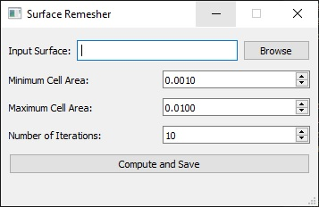

# Surface-Remesher
A simple tool to resample STL surface files with given triangle cell size.

### GUI
Double click on the file to start the software.



### CLI Usage
Use `SurfaceRemeshing.exe -h` to show the usage:

```bash
$ SurfaceRemeshing.exe -h 

```

Example usage:
```bash
$ ./SurfaceRemeshing.exe ./surface/cubic.stl ./surface/cubic_remesh.stl -m 0.1 -M 0.1 -i 5
``